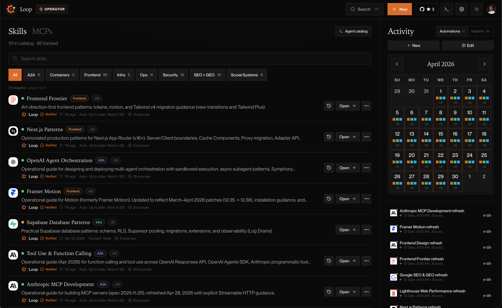
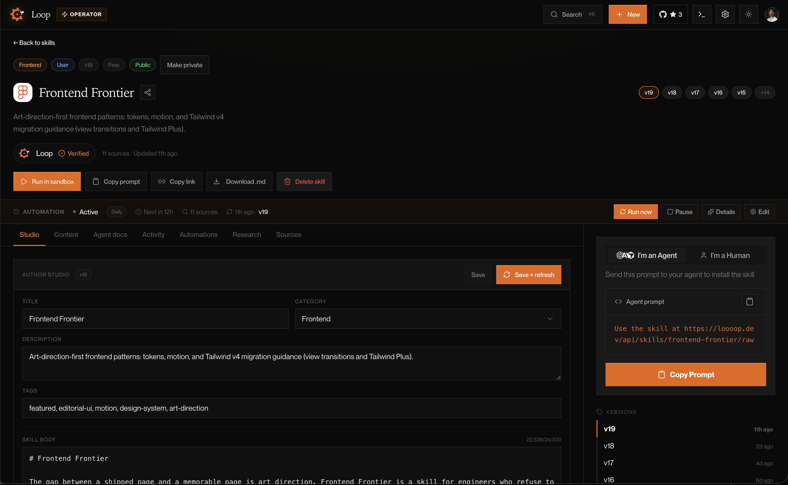
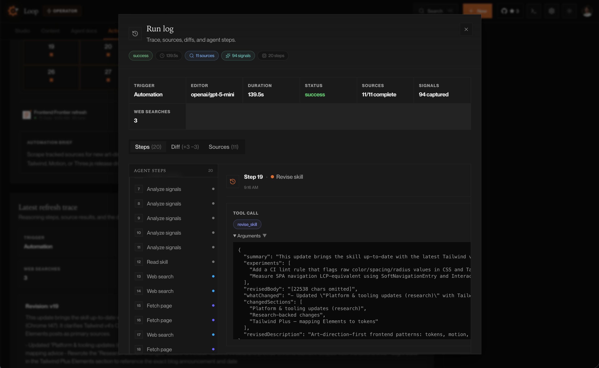
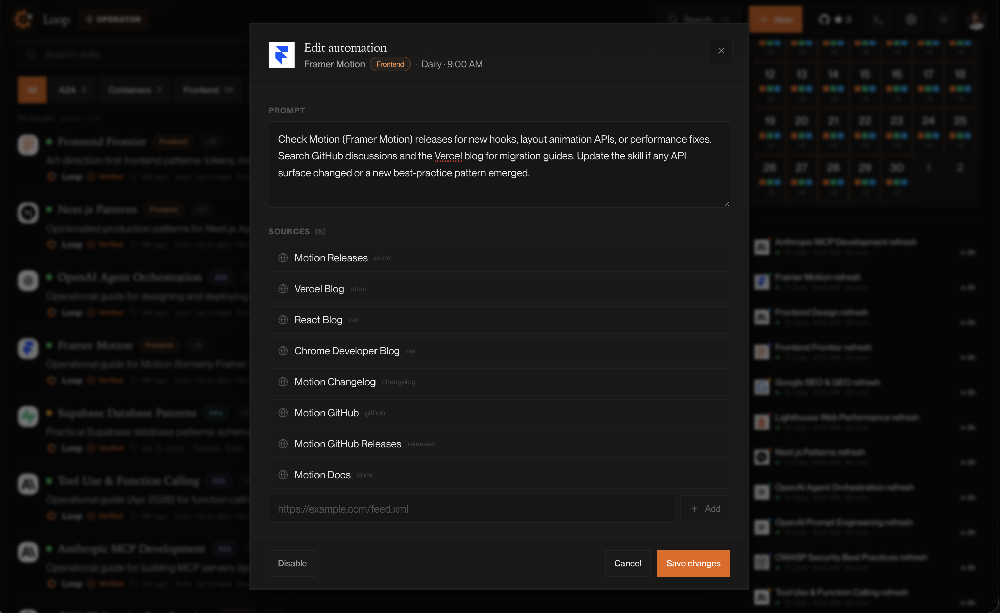
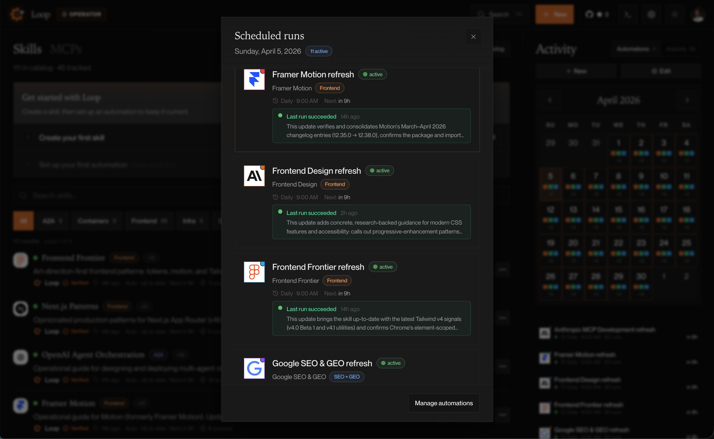
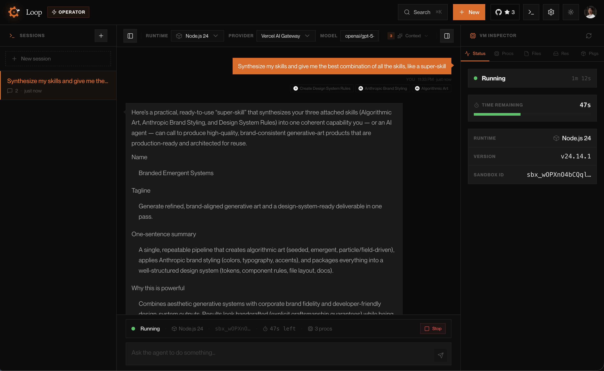

<p align="center">
  <a href="https://loooop.dev">
    
  </a>
</p>

<p align="center">
  <picture>
    <source media="(prefers-color-scheme: dark)" srcset="public/brand/loop-mark-light.svg" />
    <source media="(prefers-color-scheme: light)" srcset="public/brand/loop-mark.svg" />
    
  </picture>
</p>

<h1 align="center">Loop</h1>

<p align="center">
  An operator desk for agent skills that tracks sources, refreshes changes, and keeps every diff inspectable.
</p>

<p align="center">
  <a href="#why-loop-exists">Why Loop</a> · <a href="#shipping-beliefs">Beliefs</a> · <a href="#architecture">Architecture</a> · <a href="#local-development">Local dev</a>
</p>

---

## Why Loop exists

Building Loop taught me more about shipping fast than any framework or tool ever did.

Before this, I kept trying to make Codex automations stick. The same two gremlins kept showing up: stale refresh tokens and the fact that Codex had to stay open on my Mac like some deeply unserious daemon process. There were other automation products around, but they were either too expensive, too brittle, or too dependent on babysitting.

Loop started as the tool I wanted instead: an operator desk for agent skills that runs on its own. You track the sources a skill depends on, Loop watches those sources, and every refresh lands as a versioned diff with the full run attached.

The catalog now has 100+ verified skills, with many sitting at `v16` through `v21` after weeks of daily autonomous refreshes. That is the whole thesis in one sentence: agent skills should improve while you sleep, not decay while you forget.

## Shipping beliefs

- Automations should run unattended. If a system needs a laptop, a pinned app, or routine manual rescue, it is not automation.
- Product logic deserves the custom code. Infrastructure plumbing should be rented whenever possible.
- Every refresh should be inspectable. Sources, search traces, summaries, diffs, and version history are product surfaces, not debug leftovers.
- Managed primitives are a feature, not a compromise, when they let us spend time on the refresh pipeline, editor agent, diff viewer, and scheduler instead of undifferentiated ops work.

## Why this stack

Loop was intentionally bootstrapped as a Vercel-native system:

- **Vercel AI Gateway** gives one API key and one interface across OpenAI, Anthropic, Gemini, OpenRouter, Groq, Together, and whatever comes next. No provider abstraction layer to maintain.
- **`@vercel/queue`** turns the daily refresh cron into a fan-out dispatcher. Cron only decides what is due; workers do the heavy lifting one skill at a time.
- **`@vercel/sandbox`** provides Firecracker microVMs for safe Node.js and Python execution without standing up a bespoke compute plane.
- **`@vercel/blob`**, Cron, Analytics, and Speed Insights all drop in as product primitives instead of infrastructure side quests.
- **Supabase**, **Clerk**, **Stripe**, and **Brave Search API** handle persistence, auth, billing, and research without bloating the codebase with commodity concerns.

---

The name "Loop" was inspired by **Aryan Mahajan** — thanks for the spark.

Loop does four jobs:

1. shows a catalog of source-backed skills you can browse, track, import, or write (up to 10 per user)
2. refreshes tracked skills from external sources and saves each pass as a new version (3 automations free, unlimited on Operator)
3. exposes the update run itself with source scans, search traces, summaries, logs, and diffs
4. lets you run agents against those skills, attached prompts, and imported MCP servers in a live sandbox

## Product model

### Core objects

- **skill** — the main knowledge object. Has a body, description, tags, category, sources, automation settings, updates, and versions. All skills live in Supabase.
- **source** — a URL the refresh pipeline scans. Can be `rss`, `atom`, `docs`, `blog`, `github`, or `watchlist`.
- **update** — one refresh pass over a tracked skill. Stores summary, what changed, experiments, source items, changed sections, editor model, and whether the body changed.
- **version** — every saved skill revision gets a stable URL like `/skills/frontend-frontier/v4`.
- **automation** — a schedule that refreshes a skill on a cadence. Stored as a JSONB column on the skill in Supabase (`skills.automation`).
- **MCP** — an imported server definition that can be attached to agents. `http` and `stdio` MCPs can execute; other transports are treated as metadata.
- **usage event** — a persisted observability record for page views, copies, searches, skill actions, agent runs, and API calls.

### Skill origins

- **repo** — a `SKILL.md` found inside this project (dev only, synced to DB on refresh).
- **codex** — a `SKILL.md` found in `~/.codex/skills` (dev only, synced to DB on refresh).
- **user** — a skill created or tracked inside Loop. This is the primary production origin.
- **remote** — a skill imported from a URL and normalized into Loop's versioned format.

User and remote skills win over repo and Codex skills when slugs overlap. The tracked version should be the one you actually operate.

## Architecture

### Data layer

Loop uses **Supabase (Postgres)** as the single source of truth. There are no local filesystem stores in production.

| Table            | What it holds                                                                        |
| ---------------- | ------------------------------------------------------------------------------------ |
| `skills`         | All skill data: body, metadata, `sources` JSONB, `automation` JSONB, `updates` JSONB |
| `skill_versions` | Immutable version snapshots                                                          |
| `categories`     | Category definitions and source configs                                              |
| `mcps`           | MCP server definitions                                                               |
| `briefs`         | Daily category signal briefs                                                         |
| `loop_runs`      | Refresh run logs and outcomes                                                        |
| `usage_events`   | Observability telemetry                                                              |

Row-level security (RLS) is enabled on all tables. Anonymous access is blocked by default.

### Auth

Loop uses **Clerk** for user authentication. Sign-in/sign-up are managed flows. Billing metadata (Stripe customer ID, Connect account ID) is stored on the Clerk user profile.

### Billing

**Stripe** handles subscription checkout, portal sessions, webhook ingestion, and Connect payouts for skill sellers.

### Automation system

Automations are stored as part of each skill's `automation` JSONB column in Supabase:

```typescript
type SkillAutomationState = {
  enabled: boolean;
  cadence: "daily" | "weekly" | "manual";
  status: "active" | "paused";
  prompt: string;
  lastRunAt?: string;
  preferredHour?: number;
  preferredDay?: number;
  preferredModel?: string;
  consecutiveFailures?: number;
};
```

The daily cron (`GET /api/refresh`) is an orchestrator, not a worker. Every day at `09:00 UTC`, it checks which skills have active automations due and enqueues one refresh message per skill through `@vercel/queue`.

The queue worker (`POST /api/refresh/skill`) runs the actual research, rewrite, version save, and run logging in a separate function invocation. Retries are handled in the queue callback with backoff, and repeated failures are tracked on the skill itself.

There are no TOML files, no local filesystem paths, and no "leave Codex open on your laptop" requirements in the automation system.

## User journeys

### 1. Find a skill

Route: `/`

The home desk is the shortest path: browse the catalog, filter by category, search by name/tag/category, open a skill, or track it into your editable set.

### 2. Import or create your own

Route: `/skills/new`

You can import a remote skill from a URL or create a new user skill from scratch. Both normalize into the same tracked, versioned data model.

### 3. Set it up and refresh it

Routes: `/skills/[slug]`, `/skills/[slug]/[version]`, `/settings`

Tracked skills expose:

- the prompt and how to use the skill
- tracked sources
- automation settings (editable from calendar, sidebar, and dashboard)
- latest update summary with before/after diff
- version history
- usage and recent calls

Settings pages provide:

- `/settings/automations` — create, edit, pause, and schedule automations with a monthly calendar view
- `/settings/refresh` — trigger manual full refreshes
- `/settings/health` — system-wide usage, API traffic, and route breakdowns
- `/settings/subscription` — manage your Operator plan
- `/settings/connect` — Stripe Connect onboarding for payouts

### 4. Run agents against the catalog

Routes: `/sandbox`, `/agents`

The Sandbox provisions a secure Vercel Sandbox session. The Agent Studio lets you choose a provider and model (Vercel AI Gateway, OpenAI, OpenRouter, Groq, Together AI, or Ollama), attach skills and MCP servers, review assembled context including daily briefs, and chat with the agent. Supports code execution in Node.js and Python runtimes.

## How the refresh engine works

The refresh pipeline is the center of the product. Cron schedules work; queue workers perform the actual refreshes.

1. Load tracked skill documents from Supabase
2. Decide which skills are due for refresh (check `automation.enabled`, `cadence`, `status`, `lastRunAt`)
3. Enqueue one refresh job per due skill via `@vercel/queue`
4. Fetch signals from each skill's source watchlist inside the worker
5. Run a research-first agent that analyzes signals, then searches the web via Brave Search by default (with optional Firecrawl, Serper, Tavily, or Jina overrides) and fetches full page content as clean markdown
6. The agent revises the skill body based on evidence from both tracked sources and live web research
7. Save a new version (immutable — never mutates the old one)
8. Persist run logs, summaries, diffs, and source results
9. Record the run outcome

The worker has a dynamic step budget computed from the number of sources and search budget, with 5 steps reserved for the revision phase so research never crowds out the actual skill update.

Relevant files:

- `app/api/refresh/route.ts` — cron entrypoint and refresh fan-out
- `app/api/refresh/skill/route.ts` — queue worker callback
- `lib/queues.ts` — queue topic + publish helper
- `lib/refresh.ts` — eligibility checks, dispatch, and refresh orchestration
- `lib/skill-editor-agent.ts` — the research-first agent (step budget, tool wiring, system prompt)
- `lib/agent-tools/` — agent tools: `web-search.ts`, `fetch-page.ts`, `firecrawl.ts`, `add-source.ts`
- `lib/source-signals.ts` — signal fetching from sources
- `lib/loop-updates.ts` — update normalization
- `lib/text-diff.ts` — before/after diffing

## How skills are created and updated

### Creation paths

| Flow                        | Endpoint                 | What happens                                                 |
| --------------------------- | ------------------------ | ------------------------------------------------------------ |
| User creates from scratch   | `POST /api/skills`       | Validates input, inserts into Supabase with `origin: "user"` |
| User tracks a catalog skill | `POST /api/skills/track` | Merges skill + category sources, writes to Supabase          |
| Import a remote skill       | `POST /api/imports`      | Fetches, normalizes, inserts into Supabase                   |
| Filesystem sync (dev only)  | `refreshLoopSnapshot()`  | Reads `SKILL.md` files, upserts into Supabase                |

### Update paths

| Flow               | Trigger                          | What happens                                                              |
| ------------------ | -------------------------------- | ------------------------------------------------------------------------- |
| Daily cron         | `GET /api/refresh` (Vercel cron) | Checks due automations and dispatches per-skill refresh jobs to the queue |
| Queued refresh     | `POST /api/refresh/skill`        | Runs research, rewrites the skill, saves a version, and records the run   |
| Manual refresh     | `POST /api/admin/loops/update`   | Runs the same research + revision pipeline on demand                      |
| Edit automation    | `PATCH /api/automations/[slug]`  | Updates `skills.automation` JSONB in Supabase                             |
| Disable automation | `DELETE /api/automations/[slug]` | Sets `automation.enabled = false` in Supabase                             |
| Create automation  | `POST /api/automations`          | Sets `skills.automation` JSONB in Supabase                                |

### Seed data (development only)

The `lib/db/seed-data/` directory contains bootstrap data for development: skill source configs, MCP definitions, and skill definitions. These are applied via CLI scripts (`npx tsx lib/db/seed-automations.ts`) and are **never imported by any production code path**. In production, all data flows through the API → Supabase.

## Observability

Loop stores usage and operational telemetry in Supabase.

What gets recorded: page views, interactions, prompt/URL copies, searches, skill CRUD, automation runs, agent runs, API calls with route/method/status/duration.

Where it shows up:

- `/settings/health` — system-wide usage, route activity, 24h rolling charts
- each skill detail page — per-skill usage
- refresh dashboards — loop run logs, source scans, and diffs

## Environment variables

### Core app

```bash
NEXT_PUBLIC_SITE_URL=http://localhost:3000
CRON_SECRET=replace-me
```

### Auth (Clerk)

```bash
NEXT_PUBLIC_CLERK_PUBLISHABLE_KEY=
CLERK_SECRET_KEY=
NEXT_PUBLIC_CLERK_SIGN_IN_URL=/sign-in
NEXT_PUBLIC_CLERK_SIGN_UP_URL=/sign-up
```

### Database (Supabase)

```bash
NEXT_PUBLIC_SUPABASE_URL=
NEXT_PUBLIC_SUPABASE_ANON_KEY=
SUPABASE_SERVICE_ROLE_KEY=
```

### AI and refresh

```bash
AI_GATEWAY_API_KEY=
BRAVE_API_KEY=
# LOOP_MODEL=openai/gpt-5-mini
# FIRECRAWL_API_KEY=
```

`AI_GATEWAY_API_KEY` is required for automations and the gateway-backed editor model. `BRAVE_API_KEY` is the default web research provider. `FIRECRAWL_API_KEY` is optional for enhanced scraping. Users can also bring their own Firecrawl, Serper, Tavily, or Jina keys through Settings > Search.

### Billing (Stripe)

```bash
STRIPE_SECRET_KEY=
NEXT_PUBLIC_STRIPE_PUBLISHABLE_KEY=
STRIPE_WEBHOOK_SECRET=
STRIPE_PRICE_OPERATOR=
```

## Local development

```bash
pnpm install
pnpm dev
```

Useful commands:

```bash
pnpm test          # run tests
pnpm typecheck     # TypeScript check
pnpm build         # production build
```

### Seed data (optional, for bootstrapping)

```bash
npx tsx lib/db/seed-automations.ts   # apply sources + automation config to skills
npx tsx lib/db/seed-skills.ts        # seed skill definitions
npx tsx lib/db/seed-mcps.ts          # seed MCP server definitions
```

These scripts are idempotent and safe to re-run.

## API surface

### Main routes

- `/` — catalog desk
- `/skills/new` — import or create
- `/skills/[slug]` — redirect to latest version
- `/skills/[slug]/[version]` — versioned skill detail
- `/sandbox` — agent sandbox
- `/settings` — automations, refresh, health, subscription, connect

### Main APIs

- `GET  /api/search` — catalog search
- `POST /api/skills` — create a user skill
- `POST /api/skills/track` — track a catalog skill
- `POST /api/imports` — import a remote skill or MCP
- `GET  /api/refresh` — cron-triggered refresh
- `POST /api/admin/loops/update` — manual skill refresh
- `GET  /api/automations` — list automations (derived from skills)
- `POST /api/automations` — create an automation on a skill
- `PATCH /api/automations/[slug]` — update automation config
- `DELETE /api/automations/[slug]` — disable an automation
- `POST /api/agents/run` — run an agent with attached skills
- `POST /api/chat` — sandbox chat
- `POST /api/usage` — record usage events
- `GET  /api/models` — list available AI models
- `GET /api/billing/checkout` — Stripe checkout session
- `GET /api/billing/portal` — Stripe customer portal
- `POST /api/stripe/webhook` — Stripe webhook handler

## Deployment

This app runs locally for development, but the production architecture is intentionally Vercel-native.

For a production deploy:

1. Set `NEXT_PUBLIC_SITE_URL` to your production domain
2. Set `CRON_SECRET` for the daily refresh cron
3. Configure Supabase env vars (URL, anon key, service role key)
4. Configure Clerk env vars (publishable key, secret key)
5. Configure `AI_GATEWAY_API_KEY` for automations and `BRAVE_API_KEY` for default web research
6. Configure Stripe keys if billing is enabled
7. The cron schedule is in `vercel.json`

## Testing

Tests cover:

- automation cadence mappings, schedule formatting, and calendar scheduling
- seed data validation (minimum 4 sources per skill, actionable prompts)
- admin session helpers
- remote import parsing
- loop update normalization
- user skill versioning and updates
- settings navigation
- usage overview computations

Run all tests:

```bash
pnpm test
```

## Brand and OpenGraph

### Logos

| File                                | Variant                                             |
| ----------------------------------- | --------------------------------------------------- |
| `public/brand/loop-mark.svg`        | Gear mark — dark chip (for light backgrounds)       |
| `public/brand/loop-mark-light.svg`  | Gear mark — light chip (for dark backgrounds)       |
| `public/brand/loop-icon-accent.svg` | App icon — accent orange background with white gear |
| `app/icon.svg`                      | Favicon — dark background with white gear           |

The mark is a golden-ratio gear with a detachable chip. The animated React version lives in `components/loop-logo.tsx` (spinning gear + floating chip on hover), with path data in `lib/loop-logo-paths.ts`.

### OpenGraph images

OG images are generated dynamically at `/og` via `next/og` (`app/og/route.tsx`). The route accepts optional `title`, `description`, and `category` query params. When none are provided it renders the default card.

The card uses:

- warm dark gradient background with radial orange glow
- the gear icon as a header lockup
- `Neue Montreal` (Book + Bold) loaded from local TTF files in `app/og/`
- a product screenshot from `/images/og.png` bleeding off the right edge

SEO metadata helpers (titles, descriptions, OG images, JSON-LD) are centralized in `lib/seo.ts`.

## Screenshots

<p align="center">
  
</p>

<details>
<summary><strong>Skill catalog</strong> — browse, filter, and track skills with a live activity sidebar</summary>
<br />

</details>

<details>
<summary><strong>Skill detail</strong> — edit, version, and install any skill with one prompt</summary>
<br />

</details>

<details>
<summary><strong>Run log</strong> — trace every refresh: sources, signals, agent steps, and diffs</summary>
<br />

</details>

<details>
<summary><strong>Edit automation</strong> — configure prompts, sources, and cadence per skill</summary>
<br />

</details>

<details>
<summary><strong>Scheduled runs</strong> — see all active automations and their last run status</summary>
<br />

</details>

<details>
<summary><strong>Sandbox</strong> — run agents with attached skills in a live VM</summary>
<br />

</details>

## Short version

Loop tracks the sources your agent skills depend on, fans daily refreshes out through `@vercel/queue`, researches changes via Brave-first web search, saves every pass as a versioned revision, records the run, and exposes the whole thing in one operator desk built to ship fast.
